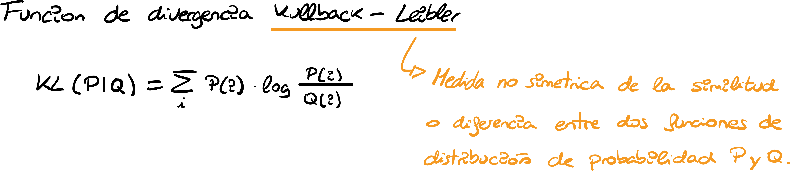
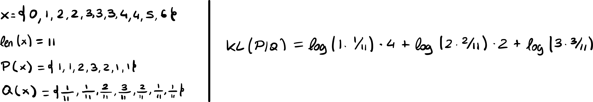
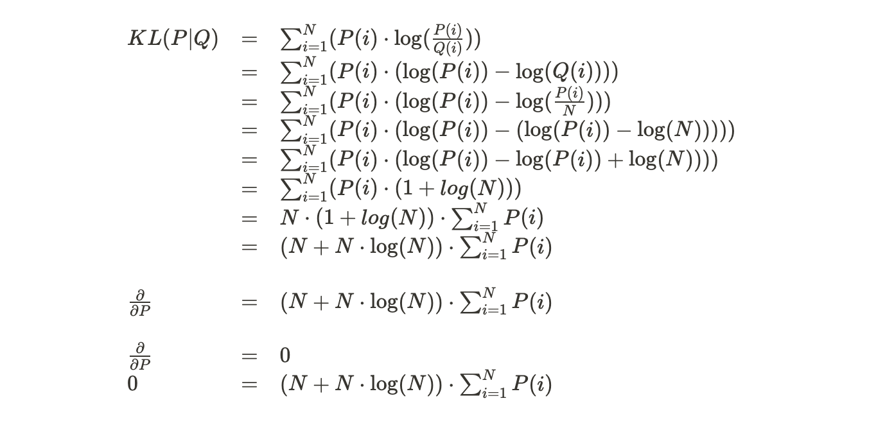

# ¿Kullback que?

Tags: Individual, Problema

Cuando trabajamos con modelos que representan una distribución de probabilidad nuestro objetivo es hacer que la distribución de los datos se acerque lo más posible a las probabilidades que nos da el modelo sobre esos datos. Existen muchas maneras de calcular esa diferencia, una común es usar funciones de divergencia, entre ellas la divergencia de Kullback-Leibler es la más usada. Dadas dos distribuciones de probabilidad 𝑃 y 𝑄 se define asumiendo que sean distribuciones discretas como:

$$
KL(P|Q)=\sum_{i=1}^{N}P(i)\cdot \log(\frac{P(i)}{Q(i)}) 
$$

En el caso de distribuciones continuas, simplemente substituimos el sumatorio por una integral.

> Siendo *𝑋* una muestra de datos $x_1, ..., x_n$ **de valores discretos, donde podemos estimar su distribución $P$ a partir de su frecuencia y $Q$ **es una distribución de probabilidad sobre el mismo rango de valores discretos. Demuestra que optimizar $KL(P|Q)$ es equivalente a optimizar la log verosimilitud negativa de $Q$ **sobre los datos.
> 

💡 Existe una relación entre $P(i)$, la frequencia, y $Q(i)$, la distribucion de probabilidad. 
$\forall i \; : \; i \in P \rightarrow (i \in Q \; \wedge \; Q(i)=\frac{P(i)}{N})$

Empezaremos optimizando la $\texttt{Log Verosimilitud Negativa de Q}.$

Ahora, seguiremos optimizando la función $KL(P|Q)$

Se puede ver como en ambas optimizaciones encontramos un mismo punto de inflexion, en ambos casos es $\sum_{i=1}^{N}P(i)$

---

> Todo modelo de clasificación es una distribución de probabilidad sobre un conjunto de valores
discretos, por lo que podemos ajustar un modelo probabilístico para clasificación haciendo que
las probabilidades que obtenga para una muestra se ajusten a las de los datos. Usa la función make_classification de scikit-learn para crear un conjunto de datos de clasificación de dos dimensiones y 100 ejemplos. Tendrás dar un valor 0 al parámetro n_redundant y un valor 1 al parámetro n_clusters_per_class. Da un valor también al parámetro random_state para que los experimentos sean reproducibles. El problema que generará será de clasificación binaria.
>
